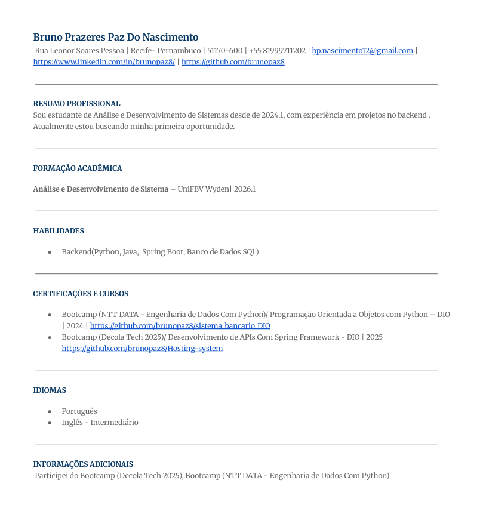
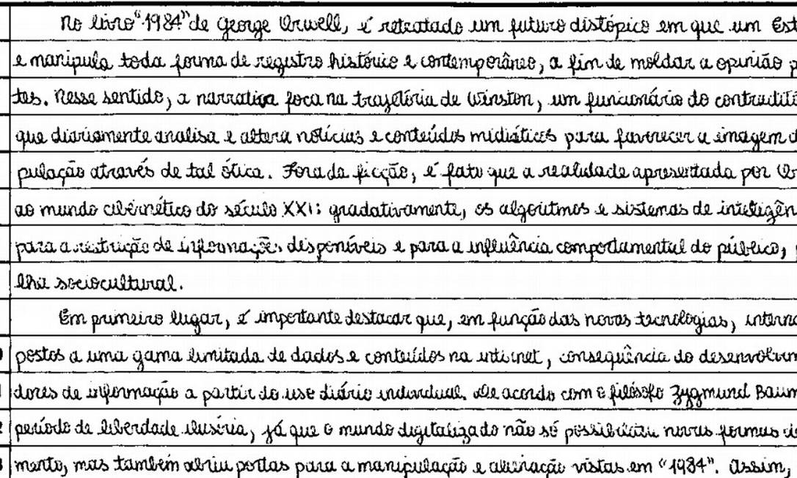

# Testando a Capacidade Analítica e Construtiva do Copilot

## Analisando Imagens  
Durante os testes, o Copilot demonstrou uma incrível capacidade de interpretar e contextualizar imagens, extraindo informações relevantes e oferecendo insights valiosos.

### Análise de um Currículo  
  
Neste teste, solicitei ao Copilot uma análise sobre um currículo, pedindo sugestões de melhorias. Sua resposta foi precisa e coerente, destacando pontos positivos e aspectos que poderiam ser aprimorados.

### Interpretação de uma Planta de Casa  
  
Aqui, testei a capacidade do Copilot de interpretar uma imagem mais complexa: a planta de uma casa. Mesmo com detalhes técnicos, a IA conseguiu fornecer uma interpretação satisfatória sobre os elementos apresentados.

### Leitura e Interpretação de uma Redação  
  
Neste exemplo, analisei a capacidade do Copilot de ler e interpretar um texto manuscrito. A IA não apenas reconheceu o conteúdo da imagem, mas também conseguiu fornecer insights baseados no contexto do texto.

### Criação de Imagem com o Copilot  
  
Esta imagem foi criada pelo Copilot. O nível de detalhe e a qualidade são perceptíveis, demonstrando a capacidade da IA de gerar imagens com base em descrições textuais. O processo envolveu a geração de uma imagem de um jovem programando um jogo, evidenciando o potencial do Copilot em áreas criativas e visuais.

## Insights e Possibilidades  
- **Reconhecimento e Análise** – O Copilot pode interpretar textos, diagramas e esquemas, tornando-se uma ferramenta útil para diversas áreas, como educação, negócios e design.  
- **Sugestões Inteligentes** – Ele consegue fornecer recomendações úteis com base no conteúdo analisado, como melhorias em documentos ou sugestões de design.  
- **Aplicações Práticas** – Pode ser utilizado em revisão de documentos, análise de plantas arquitetônicas, criação de conteúdo visual, correção de textos, e até mesmo em ambientes de aprendizado e educação.  
- **Integração com Outras Ferramentas** – O Copilot pode ser integrado a sistemas de automação de processos, análise de dados em tempo real, e assistentes virtuais, ampliando ainda mais suas possibilidades de uso.

